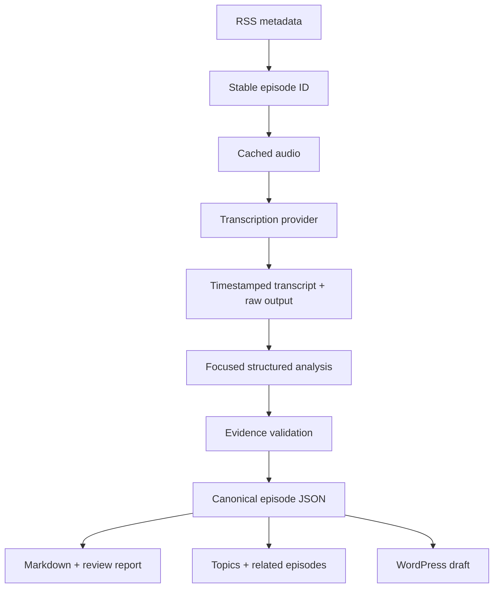

# Live From The Path Knowledge Repository

An auditable, rerunnable pipeline that turns podcast RSS/audio into canonical JSON, generated
Markdown, review reports, topic records, and **WordPress drafts only**.

## What is implemented

- RSS 2.0 ingestion, stable IDs, enclosure/artwork/episode metadata parsing
- atomic audio caching and deterministic file naming
- provider-neutral transcription contract
- OpenAI timestamped transcription adapter plus fixture adapter
- provider-neutral analysis contract
- schema-constrained OpenAI analysis plus conservative deterministic test adapter
- evidence enforcement: unsupported AI conclusions fail canonical validation
- canonical Pydantic models and emitted JSON Schemas
- Markdown, WordPress HTML, and per-episode review-report renderers
- explained related-content ranking (topic, reference, and text similarity)
- canonical topic JSON/Markdown generation
- append-only processing log, normalized transcription checkpoints, safe retries
- WordPress create-or-update draft behavior using stored post IDs
- CLI, unit tests, and three no-cost representative sample records

The included sample transcripts are intentionally short, description-derived fixtures. They prove
the mechanics but **do not validate real transcription quality** and always produce `needs-review`.

## Architecture



JSON under `episodes/` and `topics/` is canonical. Markdown and WordPress HTML are projections.
Provider output remains separate under `raw/provider-output/`.

## Setup

```bash
python -m venv .venv
. .venv/bin/activate
pip install -e '.[dev]'
cp .env.example .env
```

Export the environment variables (or use your preferred secret loader); the project deliberately
does not load or commit `.env` itself.

Required for a live run:

- `LFTP_RSS_URL`
- `OPENAI_API_KEY` for the bundled live providers

Required only when creating WordPress drafts:

- `WORDPRESS_BASE_URL`
- `WORDPRESS_USERNAME`
- `WORDPRESS_APPLICATION_PASSWORD`
- `LFTP_CREATE_WORDPRESS_DRAFTS=true`

Keep `LFTP_CREATE_WORDPRESS_DRAFTS=false` until the local review reports are approved.

## Run the zero-cost prototype

From the project directory:

```bash
export LFTP_REPOSITORY_ROOT="$PWD"
lftp-kb sample
```

This produces three episode JSON/Markdown pairs, topic records, raw audit records, processing logs,
and review reports. All three are flagged because they are excerpt fixtures.

## Run 3 live episodes

```bash
export LFTP_RSS_URL='https://livefromthepath.org/feed/podcast/'
export OPENAI_API_KEY='...'
export LFTP_REPOSITORY_ROOT="$PWD"
lftp-kb discover --limit 5
lftp-kb process --limit 3
```

On a failure, rerun the command. A completed normalized transcript is checkpointed and reused, so
an analysis failure does not pay for transcription again. Use `--force` only when deliberately
reprocessing from audio.

## WordPress dry-run and draft creation

The pipeline renders the exact WordPress body locally whether or not credentials exist. To create
drafts, set the WordPress variables and opt in with `LFTP_CREATE_WORDPRESS_DRAFTS=true`. If a
canonical record already contains `wordpress.post_id`, reruns update that post rather than creating
a duplicate. The client hardcodes status `draft`; there is no publish path in this prototype.

## Transcription comparison harness

Normalize any provider result to the `TranscriptionResult` JSON shape, then run:

```bash
lftp-kb compare-transcripts provider-a.json provider-b.json
```

It reports word counts and pairwise word-sequence similarity. For a real evaluation, add a manually
corrected reference excerpt and measure named-entity, Scripture-reference, speaker-label, and word
error rates. The raw provider response must remain stored alongside the normalized result.

## Test and schema generation

```bash
pytest -q
python scripts/export_schemas.py
```

Critical tests cover RSS parsing/stable IDs, rejection of unsupported evidence, and idempotent
WordPress update behavior.

## Adding providers

Implement `TranscriptionProvider.transcribe()` or `AnalysisProvider.analyze()` and select it in the
CLI provider factory. Orchestration, storage, rendering, WordPress, QA, and relationships do not
depend on provider-specific response shapes.

For long podcast files, add an audio preparation adapter that creates sentence-safe chunks under
the provider's upload limit and offsets returned timestamps. Chunking is intentionally not hidden
inside the canonical model.

## Repository layout

```text
episodes/              canonical JSON + generated Markdown
topics/                canonical topic JSON + generated Markdown
raw/rss/               feed snapshots
raw/transcripts/       normalized checkpoints + readable text
raw/provider-output/   unmodified provider audit output
reports/               per-episode review reports
logs/                  append-only processing events
state/                 discovery state
audio-cache/           downloaded audio (gitignored)
schemas/               exported JSON Schemas
fixtures/              explicit, non-production samples
```

See `ARCHITECTURE_REVIEW.md` before processing the full archive.
