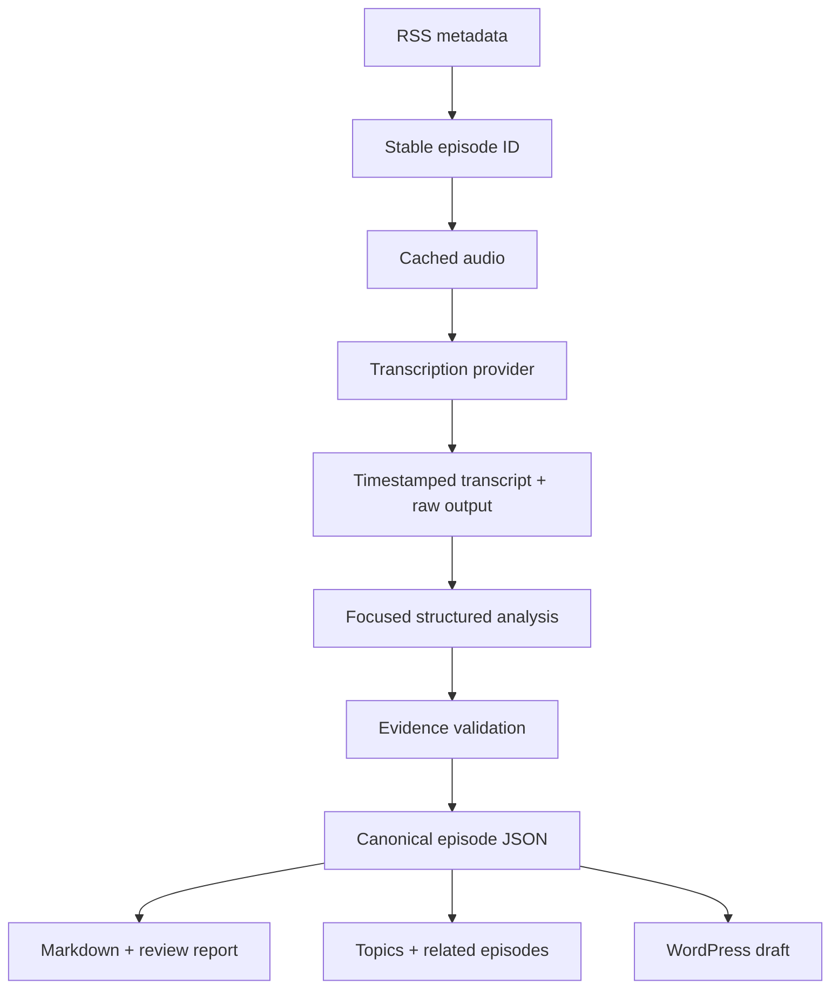

# Live From The Path Knowledge Repository

An auditable, rerunnable pipeline that turns podcast RSS/audio into canonical JSON, generated
Markdown, review reports, topic records, and **WordPress drafts only**.

## What is implemented

- RSS 2.0 ingestion, stable IDs, enclosure/artwork/episode metadata parsing
- atomic audio caching and deterministic file naming
- provider-neutral transcription contract
- OpenAI timestamped transcription adapter plus fixture adapter
- local faster-whisper CPU/GPU adapter and background benchmark screen
- provider-neutral analysis contract
- schema-constrained OpenAI analysis plus conservative deterministic test adapter
- evidence enforcement: unsupported AI conclusions fail canonical validation
- canonical Pydantic models and emitted JSON Schemas
- Markdown, WordPress HTML, and per-episode review-report renderers
- explained related-content ranking (topic, reference, and text similarity)
- canonical topic JSON/Markdown generation
- append-only processing log, normalized transcription checkpoints, safe retries
- WordPress create-or-update draft behavior using stored post IDs
- CLI, unit tests, and three no-cost representative sample records

The included sample transcripts are intentionally short, description-derived fixtures. They prove
the mechanics but **do not validate real transcription quality** and always produce `needs-review`.

## Architecture



JSON under `episodes/` and `topics/` is canonical. Markdown and WordPress HTML are projections.
Provider output remains separate under `raw/provider-output/`.

## Setup

```bash
python -m venv .venv
. .venv/bin/activate
pip install -e '.[dev]'
cp .env.example .env
```

Export the environment variables (or use your preferred secret loader); the project deliberately
does not load or commit `.env` itself.

Required for a live run:

- `LFTP_RSS_URL`
- `OPENAI_API_KEY` for the bundled live providers

Required only when creating WordPress drafts:

- `WORDPRESS_BASE_URL`
- `WORDPRESS_USERNAME`
- `WORDPRESS_APPLICATION_PASSWORD`
- `LFTP_CREATE_WORDPRESS_DRAFTS=true`

Keep `LFTP_CREATE_WORDPRESS_DRAFTS=false` until the local review reports are approved.

## Run the zero-cost prototype

From the project directory:

```bash
export LFTP_REPOSITORY_ROOT="$PWD"
lftp-kb sample
```

This produces three episode JSON/Markdown pairs, topic records, raw audit records, processing logs,
and review reports. All three are flagged because they are excerpt fixtures.

## Run the web application

```bash
export LFTP_REPOSITORY_ROOT="$PWD"
lftp-kb-web
```

Open `http://127.0.0.1:8080`. The initial application includes:

- repository dashboard and processing orientation;
- episode list and three-pane evidence/review workspace;
- review notes, guarded approval, and deterministic output regeneration;
- canonical topic browser;
- RSS/repository/local-audio inventory reconciliation;
- operational RSS/archive reconciliation with previewed, resumable audio downloads;
- non-destructive catalog reconstruction from RSS, filenames, folders, and embedded audio tags;
- transcription-provider capability and cost-planning matrix;
- non-secret source preferences and connection-status checks;
- direct access to canonical JSON, Markdown, QA reports, and WordPress-ready HTML.

### Run the local transcription benchmark on Windows

Stop the web server with `Ctrl+C`, then install the optional local provider and restart:

```powershell
python -m pip install -e ".[dev,local-transcription]"
python -m uvicorn lftp_kb.web:app --host 127.0.0.1 --port 8080
```

Open **Transcription lab**, paste the complete path to an episode audio file, and begin with a
10-minute `small.en` run. The work continues in the background; refresh the page to see status.
Run `medium.en` against the same file and length only after the first run completes. Models download
on first use. Speaker names remain unset by design: diarization and identity assignment are separate
review stages, especially important when two hosts have similar voices.

## Updating the app without replacement ZIP files

The project is a Git repository. Once it is connected to a private remote repository, future updates
are ordinary commits. On Windows, stop the server and run:

```powershell
git pull --ff-only
python -m pip install -e ".[dev,local-transcription]"
python -m pytest -q
python -m uvicorn lftp_kb.web:app --host 127.0.0.1 --port 8080
```

The first remote setup requires Git for Windows and a private GitHub (or similar) repository. Do not
commit `.env`, WordPress credentials, downloaded audio, or benchmark outputs.

Set `LFTP_LOCAL_AUDIO_ROOT` or save the archive path under Sources & providers. Saved source
preferences take effect immediately. Archive reconciliation separates feed/local matches, RSS-only
audio, archive-only candidates, and uncertain matches. Downloads are opt-in, never overwrite existing
files, retain resumable `.part` files after interruption, and record progress under
`state/archive-sync/`. Matching currently uses unique episode numbers and conservative normalized
titles; duration and audio fingerprints remain a hardening step before creating episodes from
archive-only files.

New RSS downloads use `<archive>/<publication-year>/<date>__<episode>__<title>.<ext>`. Every new
download receives a neighboring `.rss.json` sidecar containing the complete discovered RSS record,
portable relative path, byte size, and SHA-256 checksum. The inventory screen can create equivalent
sidecars for confidently matched existing files without moving or renaming them. Sidecars regenerate
the root `archive-manifest.json`; the manifest is an index, while the sidecars preserve source metadata.

### Build the master episode ledger

Open **Catalog reconstruction** and choose **Build reference list**. The scan reads the configured
archive recursively and combines it with the latest RSS discovery data. It does not move, rename,
or edit audio. Embedded episode numbers are retained as high-confidence historical evidence; RSS
episode numbers remain confirmed evidence. The separate `known_sequence_in_year` field is always
provisional and never overwrites a historical episode number.

Canonical results are written to `catalog/master-ledger.json`, with a generated
`catalog/master-ledger.csv` for sorting and review. Raw RSS and local-file observations remain under
`catalog/observations/`, and each candidate also has an individual JSON record. A four-digit year
folder is used only as medium-confidence year evidence when an audio file has no embedded date.

The reconstruction pass begins with audio assets rather than assuming every file is an episode. It
records complete SHA-256 hashes, file size, duration, full-path dates and episode notation, embedded
tags, and conflicts in `catalog/reconstruction-report.json`. Exact byte copies are consolidated
automatically. Similar-duration files with corroborating dates, numbers, titles, or sizes are queued
for listening rather than merged. Annual episode numbers, overall-series numbers, and embedded track
numbers remain separate evidence claims. Strong RSS links require multiple independent signals and
a clear margin over the next candidate; ambiguous links stay in review.

## Run 3 live episodes

```bash
export LFTP_RSS_URL='https://livefromthepath.org/feed/podcast/'
export OPENAI_API_KEY='...'
export LFTP_REPOSITORY_ROOT="$PWD"
lftp-kb discover --limit 5
lftp-kb process --limit 3
```

On a failure, rerun the command. A completed normalized transcript is checkpointed and reused, so
an analysis failure does not pay for transcription again. Use `--force` only when deliberately
reprocessing from audio.

## WordPress dry-run and draft creation

The pipeline renders the exact WordPress body locally whether or not credentials exist. To create
drafts, set the WordPress variables and opt in with `LFTP_CREATE_WORDPRESS_DRAFTS=true`. If a
canonical record already contains `wordpress.post_id`, reruns update that post rather than creating
a duplicate. The client hardcodes status `draft`; there is no publish path in this prototype.

## Transcription comparison harness

Normalize any provider result to the `TranscriptionResult` JSON shape, then run:

```bash
lftp-kb compare-transcripts provider-a.json provider-b.json
```

It reports word counts and pairwise word-sequence similarity. For a real evaluation, add a manually
corrected reference excerpt and measure named-entity, Scripture-reference, speaker-label, and word
error rates. The raw provider response must remain stored alongside the normalized result.

## Test and schema generation

```bash
pytest -q
python scripts/export_schemas.py
```

Critical tests cover RSS parsing/stable IDs, rejection of unsupported evidence, and idempotent
WordPress update behavior.

## Adding providers

Implement `TranscriptionProvider.transcribe()` or `AnalysisProvider.analyze()` and select it in the
CLI provider factory. Orchestration, storage, rendering, WordPress, QA, and relationships do not
depend on provider-specific response shapes.

For long podcast files, add an audio preparation adapter that creates sentence-safe chunks under
the provider's upload limit and offsets returned timestamps. Chunking is intentionally not hidden
inside the canonical model.

## Repository layout

```text
episodes/              canonical JSON + generated Markdown
topics/                canonical topic JSON + generated Markdown
raw/rss/               feed snapshots
raw/transcripts/       normalized checkpoints + readable text
raw/provider-output/   unmodified provider audit output
reports/               per-episode review reports
logs/                  append-only processing events
state/                 discovery state
audio-cache/           downloaded audio (gitignored)
schemas/               exported JSON Schemas
fixtures/              explicit, non-production samples
```

See `ARCHITECTURE_REVIEW.md` before processing the full archive.
